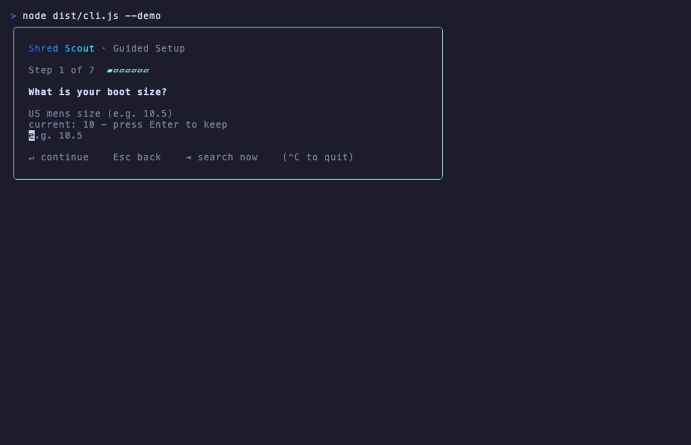

# Shred Scout

Terminal UI for finding compatible snowboard gear deals across multiple retailers.



Shred Scout builds you a snowboard setup that actually fits. It pulls live product data from a roster of snowboard brand stores, scores every board, binding, and boot against your rider profile with a deterministic compatibility engine, and renders the whole thing in a rich terminal UI with inline concept art. No account, no API keys, no LLM.

## Install

```bash
# Global install
npm install -g shred-scout
shred-scout

# Or run without installing
npx shred-scout
```

## Requirements

- Node.js 20.19+ (LTS)
- macOS or Linux (Windows not yet supported)
- [`chafa`](https://hpjansson.org/chafa/) renders inline concept and option art (board profiles, skill icons, riding-style thumbnails). The `scripts/install-chafa.mjs` postinstall step installs it automatically when possible; install it manually if that step is skipped:
  - macOS: `brew install chafa`
  - Debian/Ubuntu: `apt-get install chafa`

  Without `chafa`, concept art shows a small dim placeholder in its reserved box instead of rendering; the app stays fully usable, just without the block art. High-resolution product photos in the detail view additionally require an [iTerm2](https://iterm2.com/) or Kitty terminal (they use the inline-image protocol).

## First Run

On first launch a single guided wizard collects your rider profile and what you want to shop for:

1. Boot size, height, and weight
2. Skill level (beginner, intermediate, advanced)
3. Riding style (all-mountain, park, freestyle, powder, freeride, backcountry)
4. What you are shopping for: a snowboard, bindings, boots, or a full setup
5. A board-profile preference (only asked when a board is involved)
6. Confirm

Your profile is saved locally and reloaded on every later launch. Returning riders can press `Tab` to fast-path straight to the "what are you shopping for" choice. Flex and budget are not onboarding questions; they live as filters on the results screen so you can adjust them while you browse.

Choosing a single category drops you into the search results list. Choosing **Full Setup** opens the interactive setup builder: a pinned tray for your board, binding, and boot, plus a live candidate list where every row carries a real compatibility badge.

## Demo

```bash
# Run the offline demo (cached fixtures, in-memory database):
npm run demo

# After a global install:
shred-scout --demo
```

Demo mode skips onboarding with a sample rider and runs the full flow against bundled fixture products: boards, bindings, and boots across simulated retailers, complete with sale items and cross-retailer comparisons. No network connection or setup required.

The animated demo above is generated by [VHS](https://github.com/charmbracelet/vhs). Regenerate `docs/demo.gif` after any UI change with:

```bash
vhs demo.tape
```

## How It Works

Shred Scout is fully deterministic. There is no LLM in the loop.

**Multi-store data layer.** Stores are listed in `stores.json`. Shopify-backed brand stores are read through their public `/products.json` endpoints, paginated past the 250-item cap and throttled to stay under per-IP rate limits. evo.com is scraped from its listing and product-detail pages with Cheerio + undici to pull spec data such as waist width and flex. Products and price history persist to a local SQLite database via `better-sqlite3`; your rider profile is stored with `conf`.

**Compatibility engine.** A pure, framework-free rules engine in `src/domain/compatibility/` scores gear against your profile with no I/O and no side effects:

- Boot-to-binding size fit
- Boot-to-board waist-width clearance
- Binding disc / mount-pattern match against the board
- Board length recommended from your height, weight, and skill
- Riding-style-aware flex advisory

**Setup builder.** When you build a full setup, each candidate row shows a live fit badge computed by that engine for the gear you have already pinned, candidates are sorted compatible-first within their quality rank, and the tray reports a whole-setup verdict once all three slots are filled. Completed setups can be saved, wishlisted, and watched for price drops with `shred-scout watch`.

**Images.** Concept and option art renders as `chafa` block art so it works in any terminal. Real product photos render only in the render-once product detail view via the iTerm2 / Kitty inline-image protocol.

## CLI

```bash
shred-scout                    # Interactive search (default)
shred-scout --demo             # Offline demo with fixture data
shred-scout watch              # Foreground daemon: watch saved items for price drops
shred-scout add-store <url>    # Add a store URL (http/https only) to the search list
```

## Tech Stack

| Technology | Role |
|---|---|
| TypeScript | Language, strict mode throughout |
| Ink 6 (React for terminal) | TUI rendering with a React component model in the terminal |
| React 19.1.0 | Ink 6 peer dependency (pinned via overrides) |
| better-sqlite3 | Local product, price-history, and saved-setup storage |
| conf | Local rider-profile persistence |
| undici | Fast concurrent HTTP for Shopify pagination and scraping |
| cheerio | HTML parsing for evo.com listing and product-detail pages |
| p-queue / p-retry | Request pacing and retry for the scraping pipeline |
| tsup | ESM bundle builder |
| vitest | Unit and integration tests (461 passing) |
| Biome | Linting and formatting |

## License

MIT
